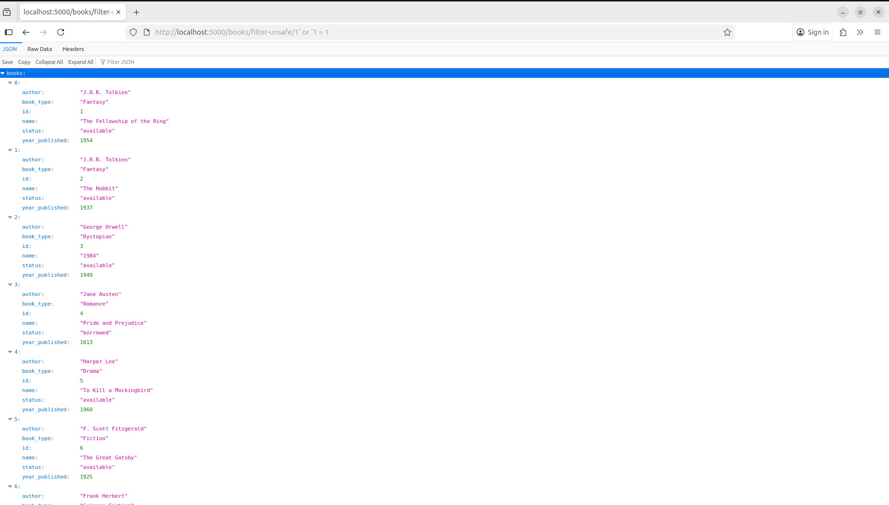

# Projekt `Balbinka`

## Zadanie 1

Proces CICD zawiera kilka etapów:

1. **Checkout repository**: Pobranie kodu źródłowego na maszynę GitHub Actions.

1. **pip audit**: Skanowanie bibliotek Pythona pod kątem znanych luk.

1. **Perform Bandit Analysis**: Statyczna analiza kodu pod kątem błędów bezpieczeństwa.

1. **Deploy for DAST analysis**: Zdalne uruchomienie aplikacji w Dockerze na serwerze zewnętrznym.

1. **zap scan**: Przeprowadzenie aktywnego ataku na działającą aplikację w celu wykrycia podatności runtime.

1. **Teardown after DAST**: Usunięcie kontenera, obrazu i plików projektu z zewnętrznego serwera po zakończeniu testów.

1. **Log in to Docker Hub**: Autoryzacja w rejestrze w celu wysyłania obrazu.

1. **Extract metadata**: Automatyczne generowanie tagów i etykiet dla obrazu Docker.

1. **Build and push**: Zbudowanie finalnego obrazu i wypchnięcie go do rejestru Docker Hub.

### Aby pobrać zbudowany obraz można wywołać:

Z gałęzi main

```sh
docker pull balbinkapublisher/balbinka:latest
```

Z innej gałęzi

```sh
docker pull balbinkapublisher/balbinka:beta
```

## Zadanie 2

- Sql injection: [job](https://github.com/domikkkk/TBO_balbinka/actions/runs/21530939741)

  Dodano podatność sql-injection przy dodawaniu książek przez dodanie endpointu w books:
  `Python/Flask_Book_Library/project/books/views.py`
  Podatność można było wykorzystać na przykład w następujący sposób.
  
  Skaner bandit wykrył tą podatność i zatrzymał wykonywania procesu.

- SCA: [job](https://github.com/domikkkk/TBO_balbinka/actions/runs/21531319782)
